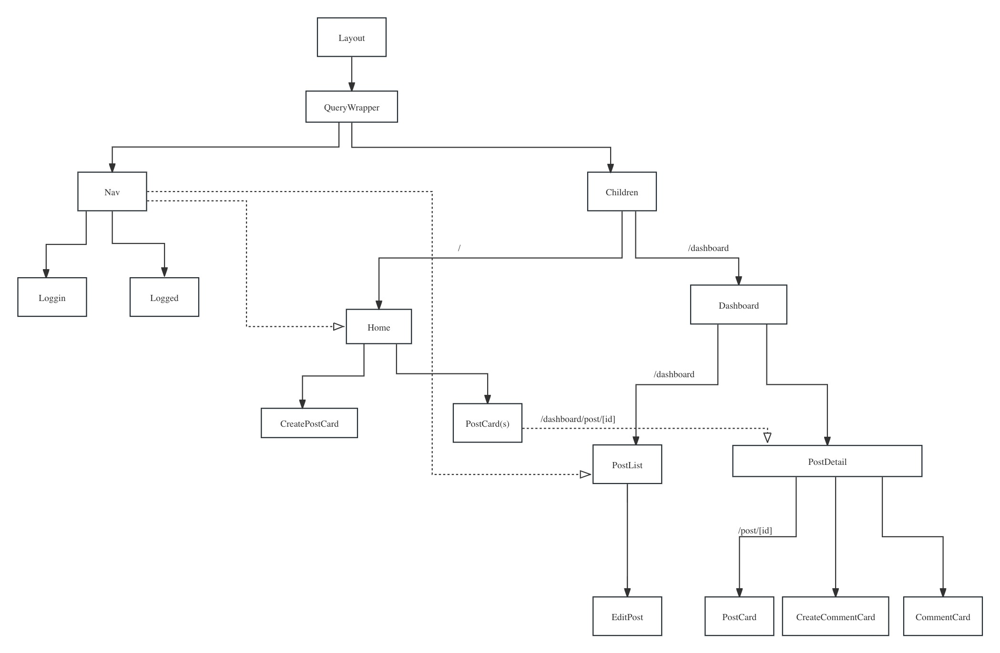
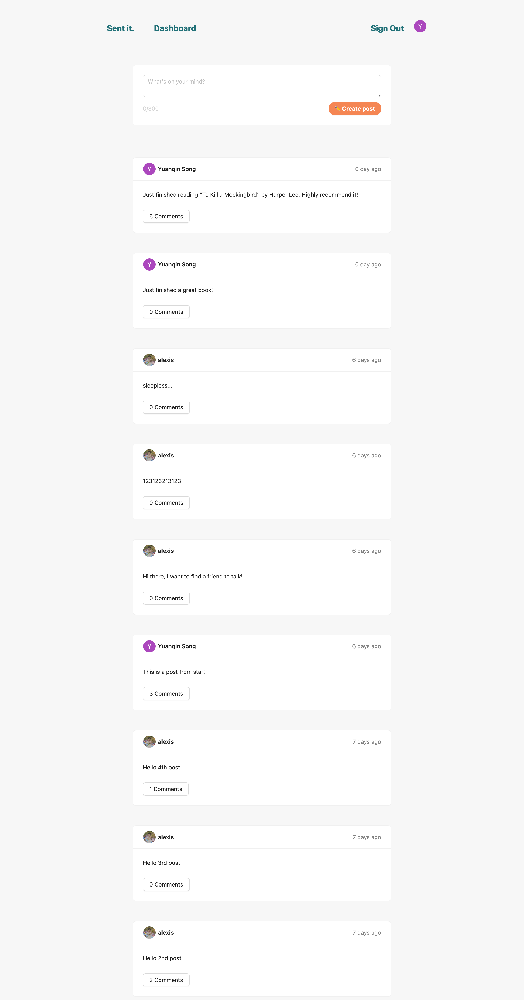
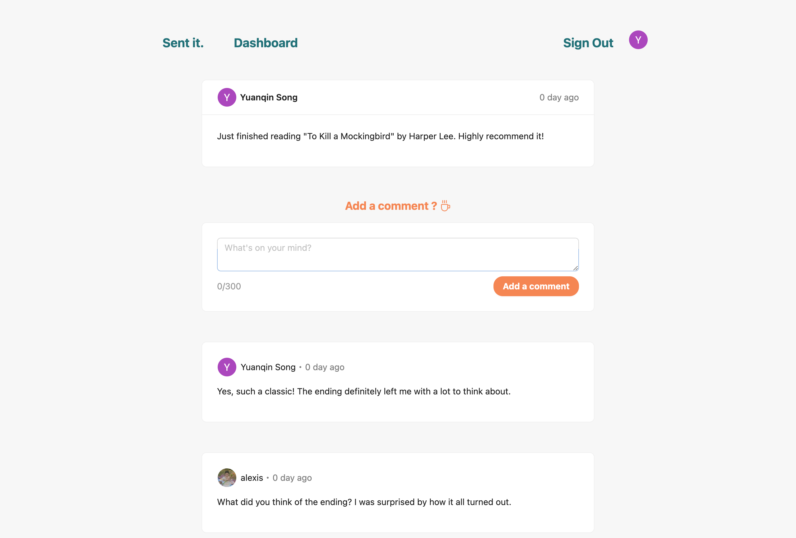
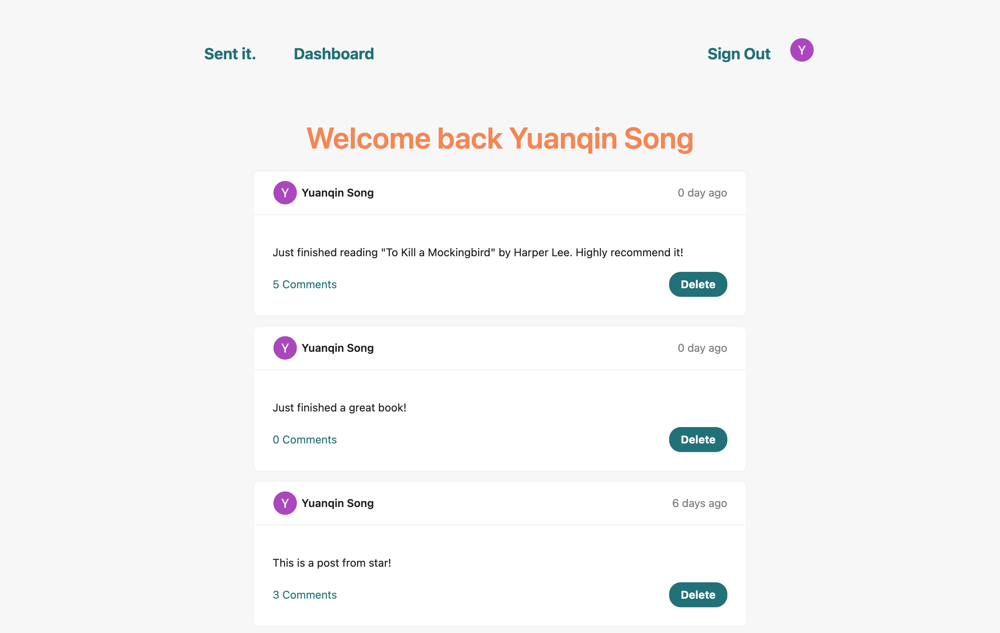

- [Getting Started](#getting-started)
- [Structure](#structure)
- [Usage Demo](#usage-demo)
  - [Landing Page](#landing-page)
  - [All Posts Page](#all-posts-page)
  - [Post Discussion (Comment Section)](#post-discussion-comment-section)
  - [Add comments](#add-comments)
  - [Dashboard](#dashboard)
- [API](#api)


This is a fullstack project utilizing [Next.js](https://nextjs.org/).
This project utilizes several technologies and libraries, including [Next.js](https://nextjs.org/), [Prisma](https://www.prisma.io/), [Toast](https://react-hot-toast.com/),  [Ant Design](https://ant.design/), [Railway](https://railway.app/), [NextAuth.js](https://next-auth.js.org/) and [PostgreSQL](https://www.postgresql.org/).


- Nextjs : Next.js is a popular open-source framework for building React applications, developed by Vercel. It is designed to simplify and streamline the development of modern web applications by providing a comprehensive set of features and optimizations out of the box.
- Prisma: Prisma is an Object-Relational Mapping (ORM) tool. Prisma helps us unify data access from multiple enterprise systems into a single API.
- Railway: Railway: Railway is an infrastructure platform that enables you to provision infrastructure, develop with it locally, and then deploy to the cloud. Railway is an infrastructure platform where you can provision infrastructure, develop with that infrastructure locally, and then deploy to the cloud.
  - Deploy Postgres on Railway. Postgres is an open-source relational database management system (RDBMS)
- NextAuth.js: NextAuth.js is an open-source authentication library for Next.js applications. It simplifies the implementation of authentication features such as sign-in, sign-up, and user session management in Next.js projects.

- Ant Design: is a design system and React UI library.
  - We mainly use **flexbox** to implement layout
- Toast:  Toast is a library for creating toast notifications in React applications. 

## Getting Started

First, run the development server:

```bash
npm run dev
# or
yarn dev
# or
pnpm dev
```

Open [http://localhost:3000](http://localhost:3000) with your browser to see the result.

## Structure

```
.
└── App
    ├── auth                (components related to auth)       
    ├── components               
    ├── dashboard              
    ├── types
    ├── page.tsx            (entry point)
    ├── pages               (restful api)
    └── prisma

``` 



## Usage Demo

### Landing Page

<video width="640" height="480" controls>
  <source src="./docs/image/landing_page.mov" type="video/mp4">
</video>

*Landing page of Postit project. User log in by hitting the Signin button and then can log in with their google account.*

### All Posts Page




*We are at **Send it** page which displays all posts, regardless of the user.*

*We can got to the view detail of a particular post by clicking its comments. And get back to the **Send it** page by clicking "Send it".*

### Post Discussion (Comment Section) 


*This page is dedicated to discussing a particular post, allowing users to view existing comments and contribute their own.*

### Add comments

<video width="640" height="480" controls>
  <source src="./docs/image/add_comments.mov" type="video/mp4">
</video>

https://github.com/imalexis/postit/blob/main/docs/image/add_comments.mov

*Add comments to the current post.*

### Dashboard



*The dashboard provides a personalized view of all posts belonging to the currently logged-in user. Users can easily manage their posts directly from the dashboard, with the option to delete individual posts using the delete button provided for each post.*

## API
- Method url
  - request
  - response
  - handler (server implementation)

- GET `api/posts/authPosts` 
  - request: {}
  - response: `AuthPosts`
  - handler: `api/posts/autoPosts.ts` 
  
- DELETE `api/posts/deletePost`
  - request: {postId: string}
  - response: {}
  - handler: `api/posts/deletePost.ts` 

- GET `/api/posts/${slug}`
  - request: {}
  - response: `Post`
  - handler: `api/posts/[detail.ts]`

- POST `/api/posts/addComment`
  - request: {data : Comment}
  - response: {}
  - handler: `api/posts/addComments`

- POST `/api/posts/addPost`
  - request: {title: string}
  - response: {}
  - handler: `api/posts/addPost.ts`
